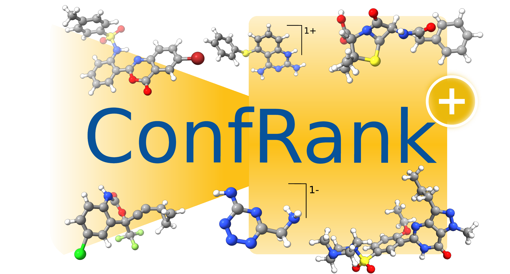

<h1 align="center"></h3>

<h3 align="center">ConfRank+: Extending Conformer Ranking to Charged Molecules</h3>
<p align="center"> A High-Throughput Machine Learning Model for Charged Molecular Conformers </p>


# Installation

You can install the python code for running the ConfRankPlus model via pip:

```bash
pip3 install git+https://github.com/grimme-lab/confrankplus.git
```

It is **highly recommended** to install `torch_cluster` for significant faster computation of atomistic graphs, e.g., by
running:

```bash
pip install git+https://github.com/rusty1s/pytorch_cluster.git
```

For further installation guidelines, see [here](https://github.com/rusty1s/pytorch_cluster/tree/master).

# Inference

## Label xyz files from command line

You can label (multiple) xyz files (or other formats supported by the `ase.io` module) with the `confrankplus` command
in your command line:

```bash
 confrankplus --files *.xyz --output_path confrank_output.xyz --total_charge 0  --fidelity r2SCAN-3c --batch_size 20
``` 

The results will be written to the path specified via `--output_path`. The units of the energies written to the output
path will be in kcal/mol.

Furthermore, in the directory `evaluate` there are example scripts for running inference on the test datasets of our
paper.

## ASE Calculator

In addition to the `confrankplus` command line interface, we provide an ASE calculator.

Example:

```python
import numpy as np

np.random.seed(0)
from ase.collections import s22
from ConfRankPlus.inference.calculator import ConfRankPlusCalculator

# load the ConfRankPlus calculator with r2SCAN-3c fidelity
calculator = ConfRankPlusCalculator.load_default(fidelity="r2SCAN-3c",
                                                 compute_forces=False)

molecule = s22['Adenine-thymine_Watson-Crick_complex']
molecule.set_calculator(calculator)
# energy before displacements:
energy_1 = molecule.get_potential_energy()
# Apply random displacements:
displacements = np.random.uniform(-0.01, 0.01, molecule.positions.shape)  # in Angstrom
molecule.set_positions(molecule.get_positions() + displacements)
# energy after displacement:
energy_2 = molecule.get_potential_energy()

# ASE uses eV as unit for energy:
print(f"The energy difference is {energy_2 - energy_1:.2E} eV.")
```

Note: our model has not been tested for geometry optimization or MD simulations.

# Loading datasets

You can load the datasets from [Zenodo](https://zenodo.org/records/15465665) as follows:

```python
from ConfRankPlus.data.dataset import HDF5Dataset

filepath = ...  # path to .h5 file 
dataset = HDF5Dataset.from_hdf5(filepath=filepath, precision=64)
```

`dataset` will be an instance of the `InMemoryDataset` class from PyTorch Geometric. 
